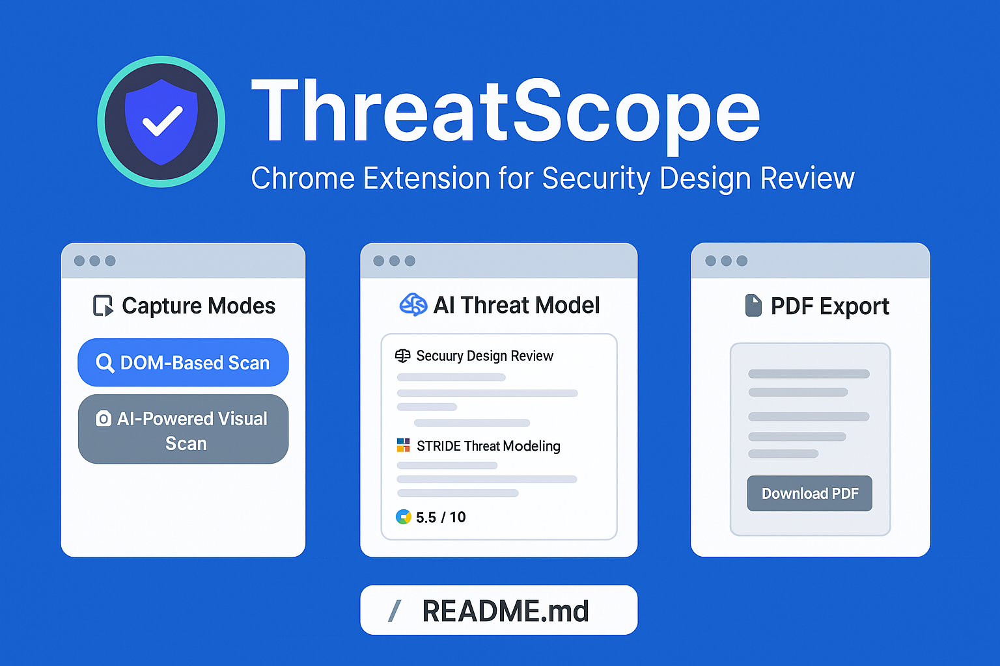
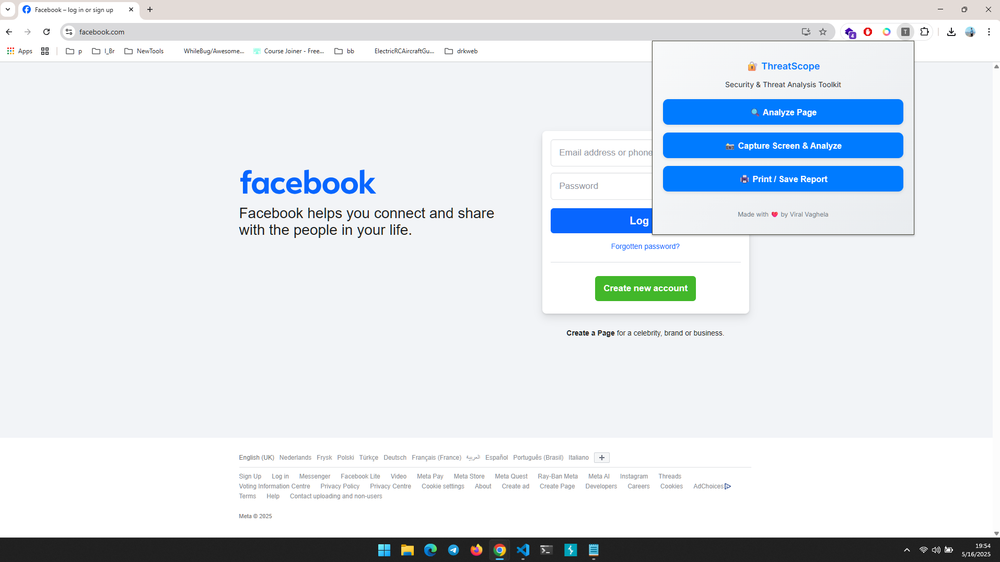
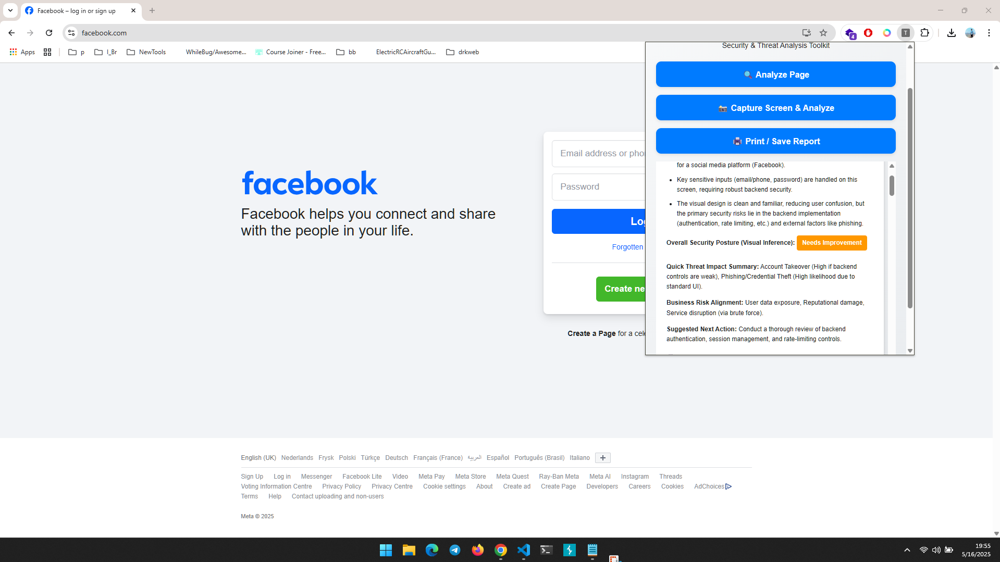
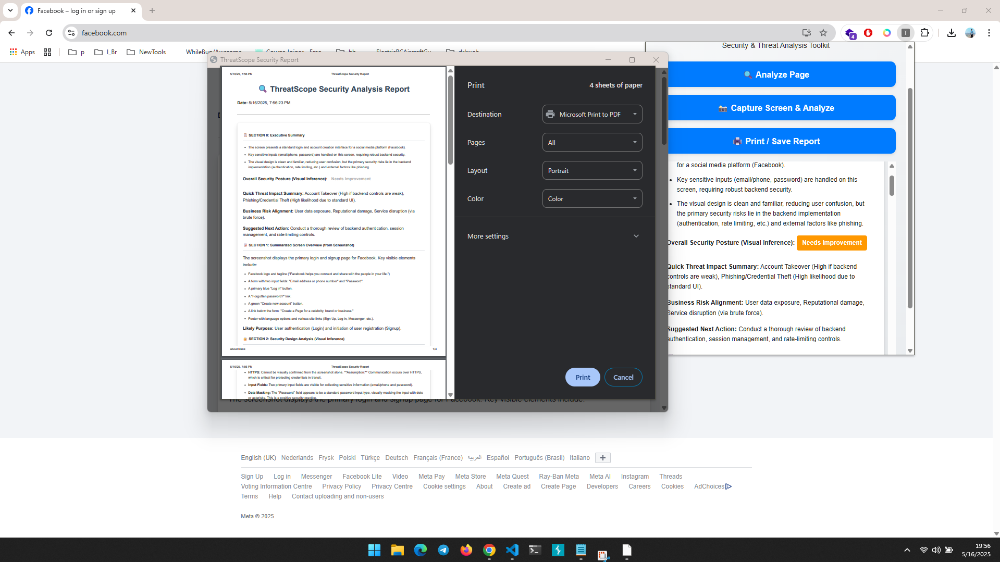

# 🛡️ ThreatScope — Chrome Extension for Security Design Review

 


**ThreatScope** is a powerful Chrome Extension built for **security researchers**, **AppSec engineers**, and **red teamers** to conduct real-time **security design reviews** of web applications.

It provides **two scanning modes**:
- ✅ **DOM-Based Scan** — Parses and analyzes input fields, form metadata, and potential client-side risks.
- 🧠 **AI-Powered Visual Scan** — Captures a full-page screenshot and uses the **Gemini Vision API** to generate a professional threat model report based on UI and layout.

---

## 🚀 Features

- 🔍 **DOM Scanner**: Analyze:
  - Input fields & types
  - Presence of password fields
  - CSRF tokens & HTTP methods
  - HTTPS validation
  - And more...
- 📸 **Screen Capture Mode**: Full-page capture + AI threat modeling
- 🤖 **Gemini Vision Integration**:
  - STRIDE threat mapping
  - Executive summary
  - Risk scoring (0–10)
  - Security design recommendations
- 📄 **Client-ready HTML Report** generated directly in the extension
- 🧾 **Export to PDF** with one click — share or archive securely

---

## 🧠 Use Cases

- Application Security Reviews (SDLC)
- Red Team Reconnaissance
- Threat Modeling Demonstrations
- Client Deliverables for AppSec Consulting
- Secure Design Validation for Login/Signup/Profile forms

---

## 📸 Screenshots

| Capture Modes | AI Threat Model | PDF Export |
|---------------|------------------|-------------|
|  |  |  |

---

## 📁 Project Structure

```threatscope/
├── extension/ # Chrome Extension (popup, background, DOM scanner)
├── server/ # Flask backend (Gemini Vision integration)
├── assets/ # screenshots...
├── README.md # Project documentation
```
## Sample Reports

- [1. Facebook Login Screen (Screenshot-based)](assets/sample_report_fb_login.pdf)
- [2. Instagram Login Form (DOM-based)](assets/sample_report_instagram_signup.pdf)
- [3. Twitter Home after Auth (Screenshot-based)](assets/twitter_home_after_auth.pdf)
- [4. Twitter Home after Auth (DOM-based)](assets/twitter_home_after_auth._DOM_based.pdf)

## 🛠️ How to Use

### 1. Install Chrome Extension

1. Clone the repo:
   ```bash
   git clone https://github.com/viralvaghela/threatscope.git
   cd threatscope
   
2. Go to chrome://extensions

3. Enable Developer Mode

4. Click Load Unpacked → Select the extension/ folder

### 2. Start Flask Backend (Gemini API)
```bash
cd server
pip install -r requirements.txt
python app.py
```

Ensure your API key is set inside app.py:
```py
genai.configure(api_key="YOUR_GEMINI_API_KEY")
```

## 🧠 Built With
```
HTML, CSS, JavaScript (Chrome Extension)
Python + Flask (Server)
Gemini  Vision API (LLM-powered threat modeling)
```

## 🧰 Future Enhancements
- Store historical scans
- Context-aware checklist customization
- Annotate screenshots in the report
- Role-based summary generator (executive vs. technical

## 🤝 Contributing
Pull requests are welcome! Open an issue to suggest new features or improvements.
```bash
git clone https://github.com/yourusername/threatscope.git
```

## 👨‍💻 Created by
Viral Vaghela
🔗 https://viralvaghela.com


